

  
  <h3> Deploy Self-Hosted Home Server on Oracle Cloud using Terraform and Ansible  </h3> 

## Contents

- [Contents](#contents)
- [Introduction](#introduction)
- [Screenshots](#screenshots)
- [Prerequisites](#prerequisites)
- [Setup](#setup)
- [Deploy](#deploy)
- [Important Notes](#important-notes)
- [Contributing](#contributing)
- [Authors](#authors)
- [License](#license)

## Introduction

- Casadora is a set of terraform and ansible scripts to create and deploy a home server on arm64 machinces of oracle cloud.
- The choices taken for deploying the services and their settings are opinionated as I wanted to reduce the options and configuration for initial deployment.
- The services deployed are as follows:

  1. [Traefik](https://github.com/traefik/traefik)
  2. [Traefik-Certs-Dumper](https://github.com/ldez/traefik-certs-dumper)
  2. [AdGuardHome](https://github.com/AdguardTeam/AdGuardHome)
  3. [Wg-Easy](https://github.com/WeeJeWel/wg-easy)
  4. [Portainer](https://github.com/portainer/portainer)
  5. [Prometheus](https://github.com/prometheus/prometheus)

        - Exporters for Prometheus
            1. [Node-Exporter](https://github.com/prometheus/node_exporter)
            2. [Cadvisor](https://github.com/google/cadvisor)
            3. [Adguard Exporter](https://github.com/ebrianne/adguard-exporter)
            4. [Traefik Exporter (Directly enabled through traefik)](https://doc.traefik.io/traefik/observability/metrics/prometheus/)

  6. [Grafana](https://github.com/grafana/grafana)

- The services and their configurations can be changed by editing the `docker-compose.yml` file inside the `ansible` directory

## Screenshots

  |  Heimdall                                    | Traefik                                                |
  |----------------------------------------------|------------------------------------------------------- |
  |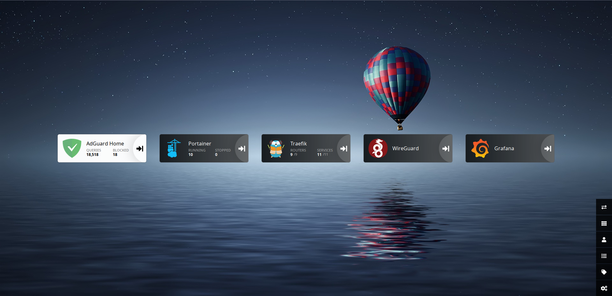        | 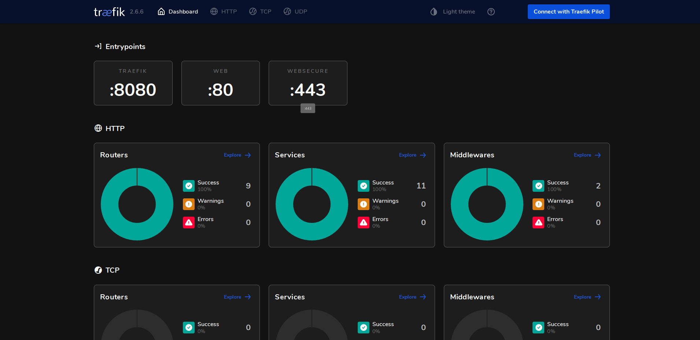                    |
  | **Portainer**                                | **AdGuardHome**                                       |
  |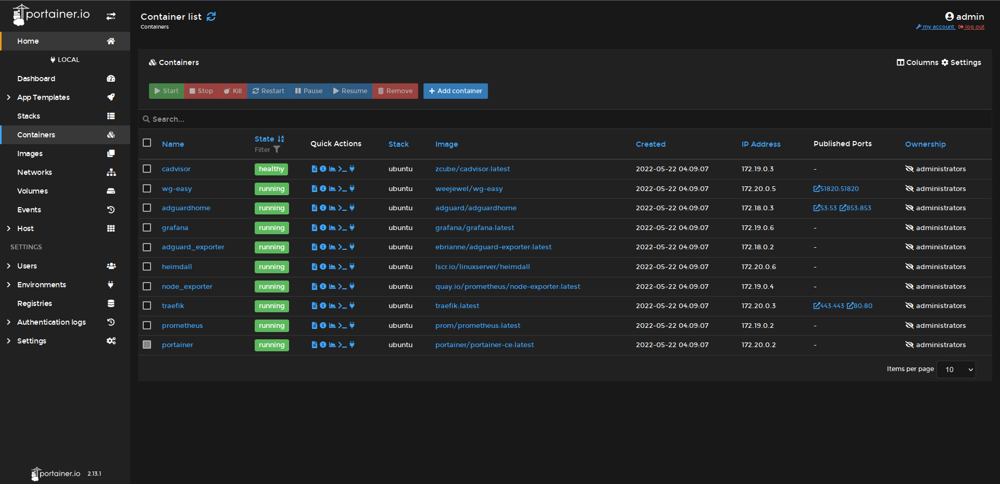     | 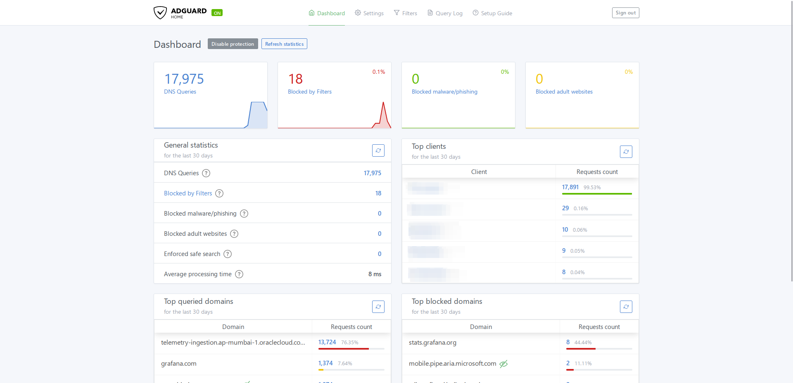           |
  |  **Grafana**                                  | **WG-Easy**                                           |
  |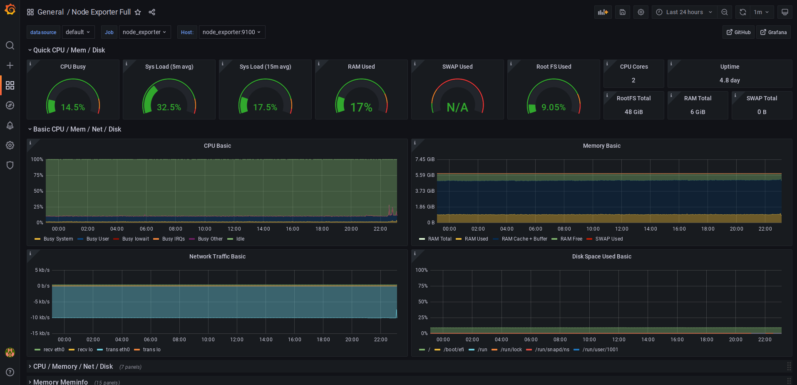         | 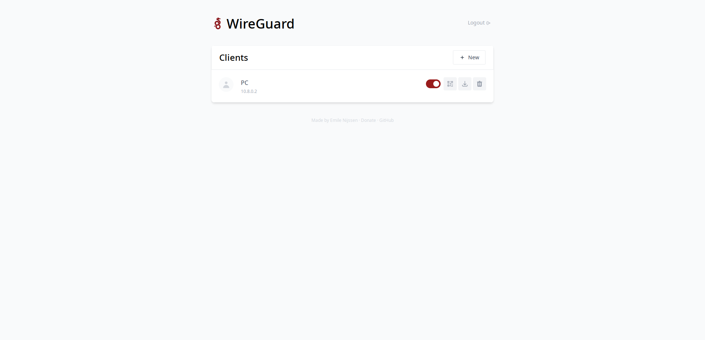                  |

## Prerequisites

- ### Move domain to cloudflare
  - Casadora is setup to be used with cloudflare under default configuration,so a domain which is handled by cloudflare is required.

- ### Verify Oracle Cloud Requirements
  - Make sure that your Oracle Cloud Account can create a **2 OCPU** ARM64 instance with **6 GB** Ram and **50 GB** Storage
- ### Install Terraform
  - [Install terraform](https://learn.hashicorp.com/tutorials/terraform/install-cli) for your operating system
- ### Install Ansible
  - [Install ansible](https://docs.ansible.com/ansible/latest/installation_guide/intro_installation.html) for your operating system

## Setup

- ### Clone the repo
  - Execute the following command in terminal
      
      `git clone https://github.com/CoolFool/Casadora.git`
  - Change directory to **Casadora** with `cd Casadora`

- ### Terraform

  - #### Generate SSH Key (If you dont have one)

    - #### Generating SSH Key

      1. Open terminal
      2. `ssh-keygen -t ed25519 -C "your_email@example.com"`

      This creates a new SSH key, using the provided email as a label.

            > Generating public/private algorithm key pair.

      1.  When you're prompted to "Enter a file in which to save the key," press Enter. This accepts the default file location.

              > Enter a file in which to save the key (/home/you/.ssh/algorithm): [Press enter]

      2.  At the prompt, type a secure passphrase. For more information, see "Working with SSH key passphrases."

              > Enter passphrase (empty for no passphrase): [Type a passphrase]

              > Enter same passphrase again: [Type passphrase again]

    - #### Adding your SSH key to the ssh-agent

      1.  Start the ssh-agent in the background.

          `$ eval "$(ssh-agent -s)"`

              > Agent pid 59566

      2.  Add your SSH private key to the ssh-agent. If you created your key with a different name, or if you are adding an existing key that has a different name, replace id_ed25519 in the command with the name of your private key file.

          `$ ssh-add ~/.ssh/id_ed25519`

  - #### Configure Oracle Cloud
    1.  | Select Account|
        | ------------ | 
        |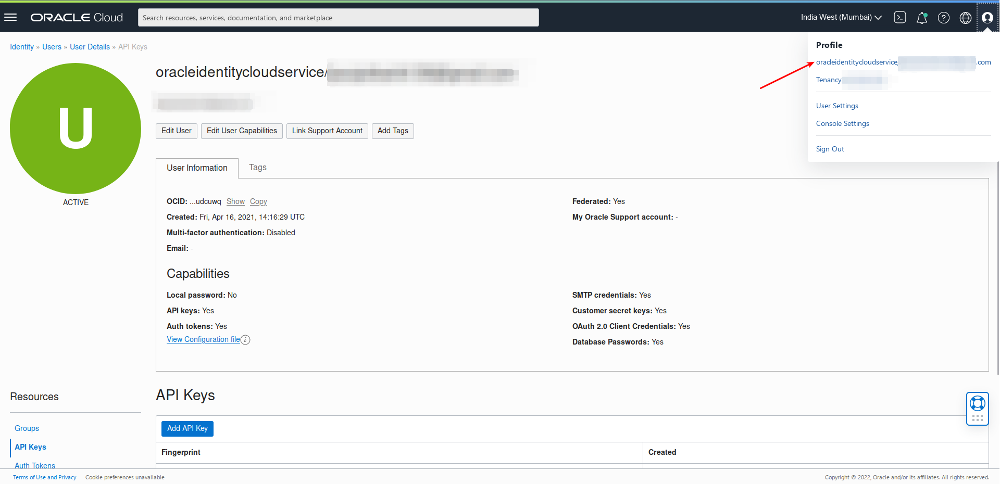 |

    2.  | Add API Key|
        | ------------ | 
        |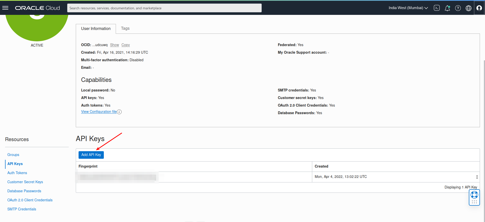 |

    3.  | Download Private Key and Click on Add|
        | ------------ | 
        |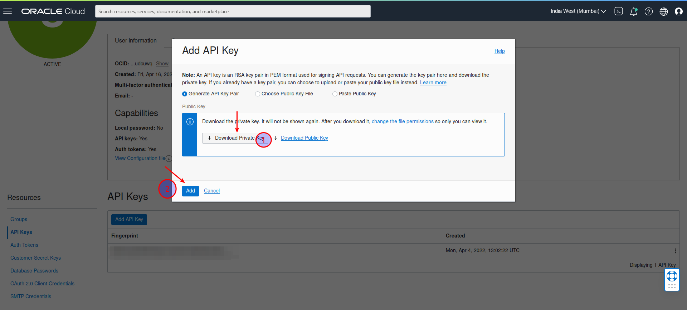 |

    4.  | Copy the API Information|
        | ------------ | 
        |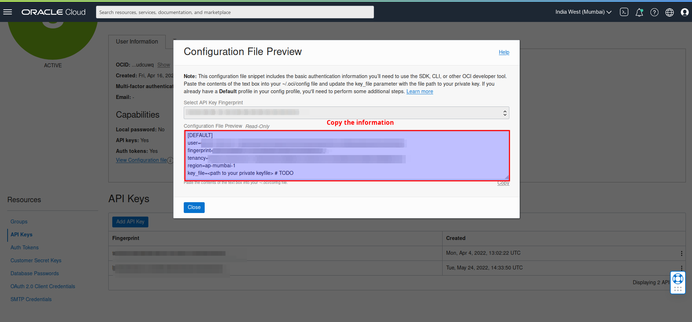 |

  - #### Configure Cloudflare
    1.  | Select Profile|
        | ------------ | 
        |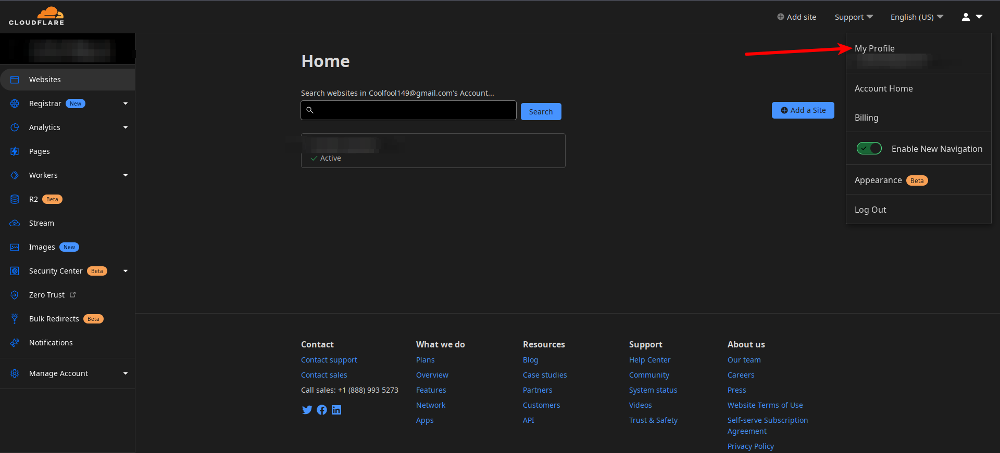 |

    2.  | Select API Tokens and Create Token|
        | ------------ | 
        |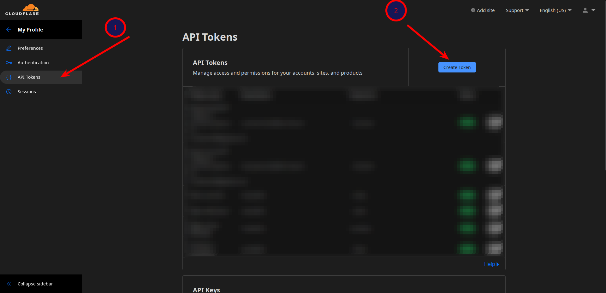 |

    3.  | Select Edit Zone API Template|
        | ------------ | 
        |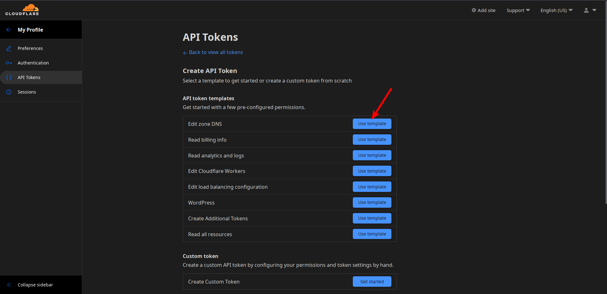 |

    4.  | Select specific zone and continue|
        | ------------ | 
        |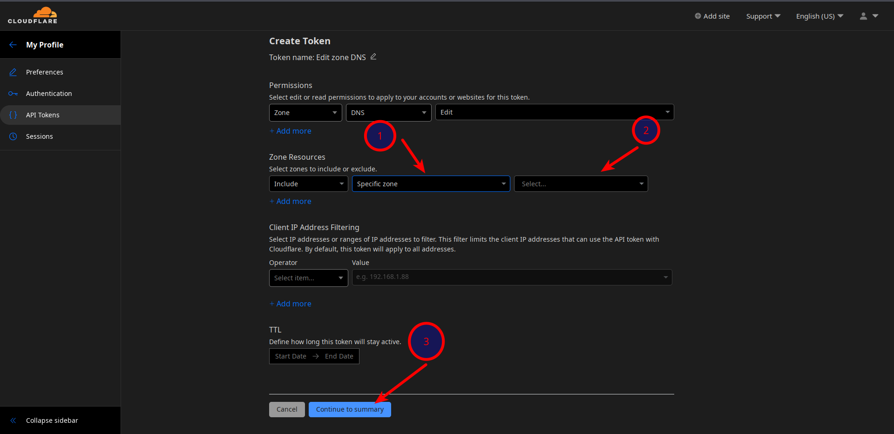 |

    5.  | Create Token|
        | ------------ | 
        |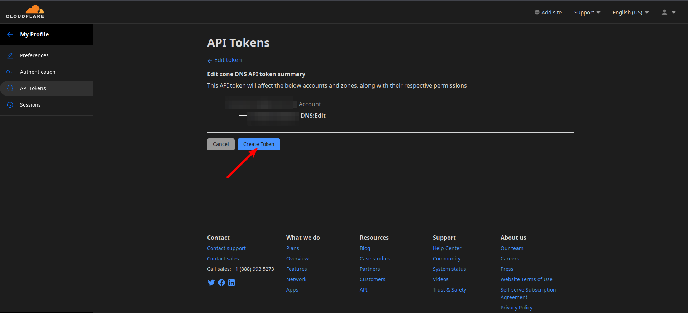 |

    6.  | Copy and Save the API Token|
        | ------------ | 
        |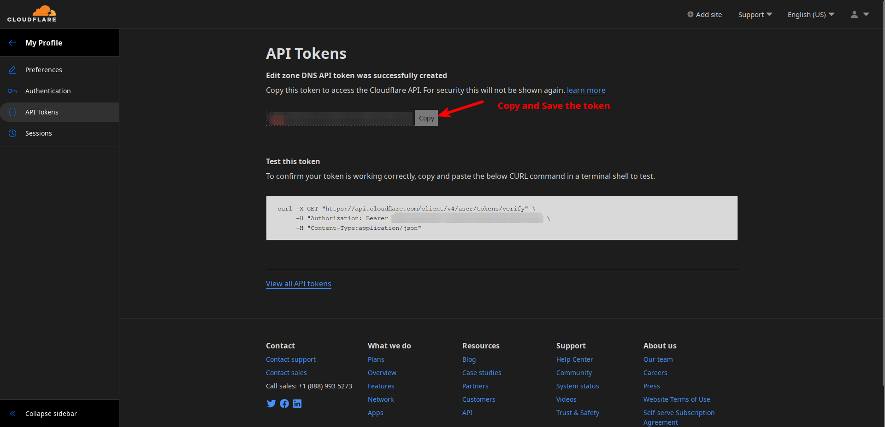 |

  - #### Set Terraform Variables

    - Rename `terraform.example.tfvars` to `terraform.tfvars` in the `terraform` directory.
    - Fill the variables with the values obtained from the previous steps
    - The variables are as follows:

      - #### Oracle

        1. `oci_tenancy_ocid` - [From Oracle Cloud API Key](#oracle-cloud)
        2. `oci_user_ocid` - [From Oracle Cloud API Key](#oracle-cloud)
        3. `oci_private_key_path` - [From Oracle Cloud API Key](#oracle-cloud)
        4. `oci_fingerprint` - [From Oracle Cloud API Key](#oracle-cloud)
        5. `oci_region` - [From Oracle Cloud API Key](#oracle-cloud)
        6. `oci_instance_name` - [From Oracle Cloud API Key](#oracle-cloud)
        7. `oci_ssh_public_key_path` - [SSH Public Key Path](#generate-ssh-key-if-you-dont-have-one) generated in previous step (Example: `/home/coolfool/.ssh/id_ed25519.pub`)

      - #### Cloudflare

        1. `cf_api_token` - [Cloudflare API Token](#cloudflare) generated in previous steps
        2. `cf_domain_name` - Cloudflare managed and API token accessible domain name
        3. `cf_adguard_record_name` - subdomain to create for adguard (default : `adguard`)
        4. `cf_heimdall_record_name` - subdomain to create for heimdall (default : `heimdall`)
        5. `cf_traefik_record_name` - subdomain to create for traefik (default : `traefik`)
        6. `cf_grafana_record_name` - subdomain to create for grafana (default : `grafana`)
        7. `cf_portainer_record_name` - subdomain to create for portainer (default : `portainer`)
        8. `cf_wireguard_record_name` - subdomain to create for wireguard (default : `wireguard`)

      - #### Ansible services (passwords should be in plaintext cause the required format and hash for respective services is autogenerated)

        1. `ansible_ssh_private_key_path` - [SSH Private Key Path](#generate-ssh-key-if-you-dont-have-one) generated previously (Example: `/home/coolfool/.ssh/id_ed25519`)
        2. `ansible_traefik_username` - Username to be used for traefik dashboard
        3. `ansible_traefik_password` - Password to be used for traefik dashboard in plaintext
        4. `ansible_lets_encrypt_email` - Email address for lets encrypt certificate notfications
        5. `ansible_adguard_username` - Username to be used for adguard
        6. `ansible_adguard_password` - Password to be used for adguard
        7. `ansible_wireguard_password`  - Password to be used for wireguard dashboard

- ### Ansible
  - #### Auto-Run Playbook
    Ansible playbook is auto-run when terraform creates the resources using the values from `terraform.tfvars`
  - #### Manually Run Playbook
        
    To manually run the playbook the following commands should be executed inside the `ansible` directory

    1. For updating and installing docker & docker-compose

        `ANSIBLE_HOST_KEY_CHECKING=False ansible-playbook -u ubuntu -i '<SERVER_IP_ADDR>,' --private-key <PRIVATE_SSH_KEY_PATH> housekeeping.yml`

    2. For Setting and Starting the services

        `ANSIBLE_HOST_KEY_CHECKING=False ansible-playbook -u ubuntu -i '<SERVER_IP_ADDR>,' --private-key <PRIVATE_SSH_KEY_PATH> setup-services.yml`

(<a href="#top">back to top</a>)

## Deploy

To create the instance and deploy the services run the following commands inside `terraform` directory

1. `terraform init`
2. `terraform apply`

(<a href="#top">back to top</a>)

## Important Notes 

- For Grafana use the following dashboards:
  1. [Adguard](https://grafana.com/grafana/dashboards/13330)
  2. [Cadvisor](https://grafana.com/grafana/dashboards/14282)
  3. [Node Exporter](https://grafana.com/grafana/dashboards/1860)
  4. [Traefik Metrics](https://grafana.com/grafana/dashboards/12250)
    Ofcourse you can use any dashboard which supports the deployed [exporters](#introduction)
- If you want to take down the docker services from within the server through ssh use the command `docker-compose --env-file setup.env down` while for starting use the command `docker-compose --env-file setup.env up --detach`
- The `setup.env` file is auto-generated in `/home/ubuntu/` with the required values through ansible
- For Portainer and Grafana user should be created manually as prompted by the services at first use.
- Services should be manually added to heimdall after verifying if everything works correctly
- Manually running ansible playbook will erase adguard logs and configuration
- `traefik-certs-dumper` is required cause traefik uses acme.json as certificate storage which is not compatible with adguardhome
- The SSL Certificates are stored in `/home/ubuntu/letsencrypt/certs/`
- DNS-over-HTTPS endpoint for AdGuardHome is `https://adguard.example.com/dns-query` (replace `example.com` with your domain)
- If DNS-over-HTTPS doesn't work setup portainer and restart `traefik-certs-dumper` and `adguardhome` containers
- DNS-over-TLS endpoint for AdGuardHome is `adguard.example.com` (replace `example.com` with your domain)
- AdGuardHome is deployed with few filters,if it causes problems with websites remove it from the list which is found at Adguard Dashboard:  **Filters** -> **DNS blocklists**  

## Contributing

Contributions are what make the open source community such an amazing place to learn, inspire, and create. Any contributions you make are **greatly appreciated**.

If you have a suggestion that would make this better, please fork the repo and create a pull request. You can also simply open an issue with the tag "enhancement".
Don't forget to give the project a star! Thanks again!

1. Fork the Project
2. Create your Feature Branch (`git checkout -b feature/AmazingFeature`)
3. Commit your Changes (`git commit -m 'Add some AmazingFeature'`)
4. Push to the Branch (`git push origin feature/AmazingFeature`)
5. Open a Pull Request

(<a href="#top">back to top</a>)

## Authors

- [@coolfool](https://www.github.com/coolfool)

(<a href="#top">back to top</a>)

## License

[MIT](https://choosealicense.com/licenses/mit/)

(<a href="#top">back to top</a>)

